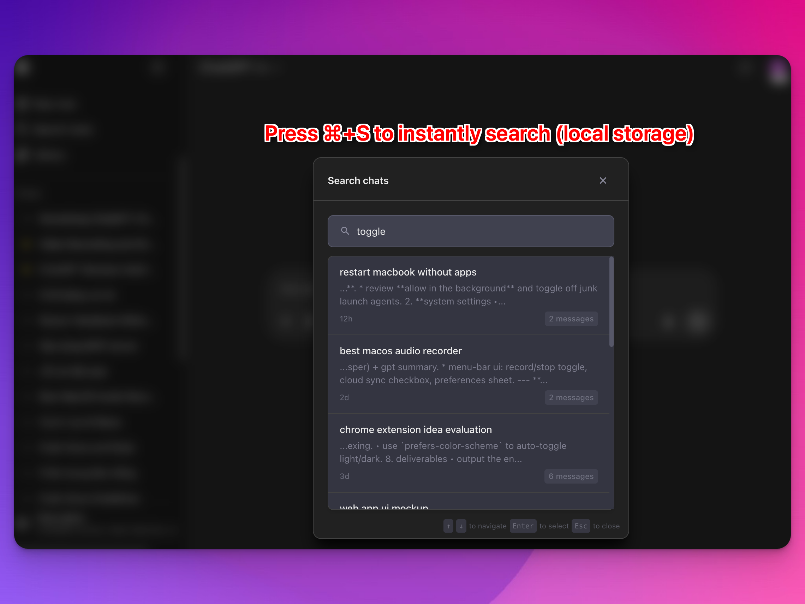
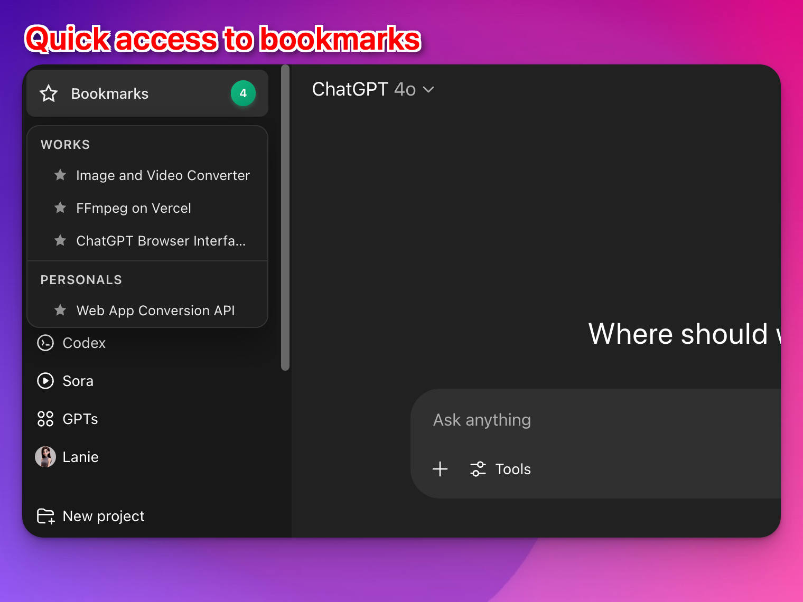
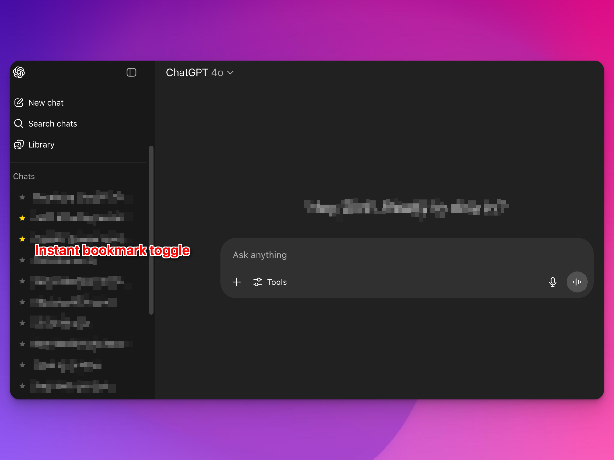
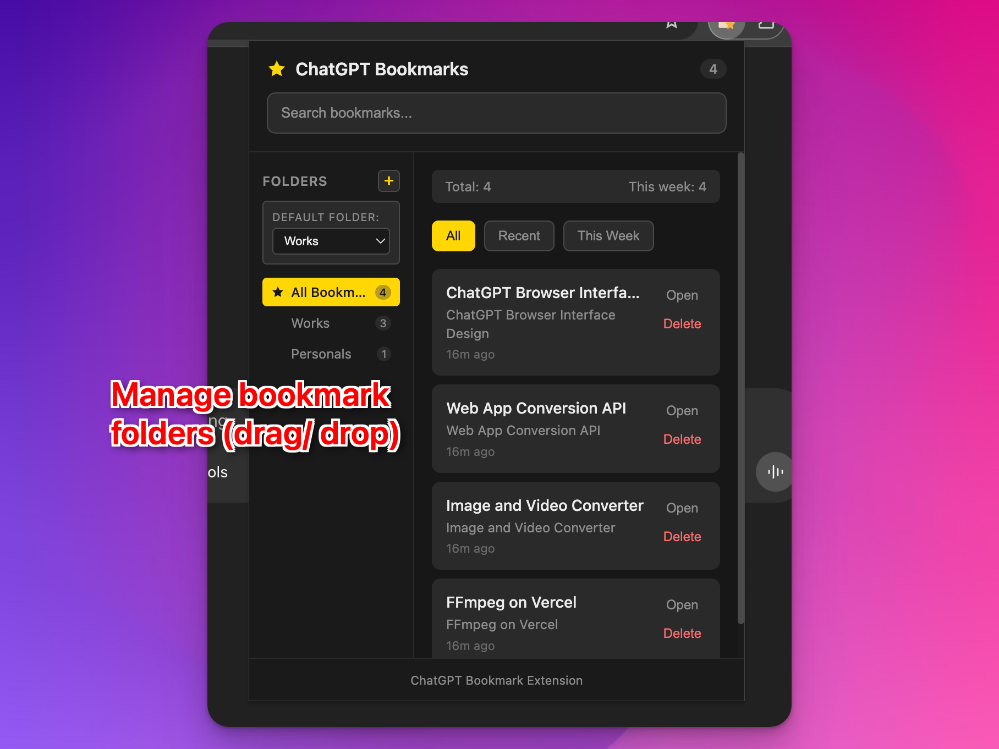

# ChatGPT Bookmark & Search Extension

A powerful Chrome extension that adds bookmarking and full-text search functionality to ChatGPT conversations.



## Features

### 🔍 Full-Text Search
- **Conversation Crawling**: Automatically indexes all your ChatGPT conversations
- **Floating Search Popup**: Press `⌘+S` (Mac) or `Ctrl+S` (Windows/Linux) to open a floating search interface
- **Smart Search**: Search through all your conversation history with intelligent snippets and highlighting
- **Real-time Results**: Get instant search results as you type

### 📌 Bookmarking
- **Quick Bookmarks**: Click the star (★) icon next to any conversation to bookmark it
- **Persistent Storage**: All bookmarks are saved locally using IndexedDB
- **Easy Management**: View and manage bookmarks in the sidebar and extension popup



### 🚀 Advanced Features
- **Incremental Sync**: Automatically syncs new conversations without re-indexing everything
- **Message Navigation**: Click search results to navigate directly to specific messages
- **Dark Theme**: Seamlessly integrates with ChatGPT's dark theme
- **Draggable Interface**: Move the search popup anywhere on screen



## Add to Google Chrome

**Option 1: Chrome Web Store (Recommended)**
- [Add to Chrome](https://chrome.google.com/webstore) - *Coming Soon*

**Option 2: Install from Source**
1. Download or clone this repository
2. Open Chrome and go to `chrome://extensions/`
3. Enable "Developer mode" in the top right
4. Click "Load unpacked" and select the extension folder
5. Visit ChatGPT (https://chatgpt.com) to start using the extension

## Usage

### Search Your Conversations
- **Keyboard Shortcut**: Press `⌘+S` (Mac) or `Ctrl+S` (Windows/Linux) while on ChatGPT
- **Button Click**: Click the user menu button in the top-right header
- **Type to Search**: Start typing to search through all your conversations
- **Navigate**: Click any result to jump to that conversation and message

### Bookmark Conversations
- **Add Bookmark**: Click the star (★) icon next to any conversation in the sidebar
- **View Bookmarks**: See all bookmarks in the sidebar "Bookmarks" section
- **Remove Bookmark**: Click the star icon again to remove a bookmark



### Manual Controls
Access debug and manual controls via the browser console:
```javascript
// Start a full crawl of all conversations
window.chatgptBookmarkDebug.startCrawl(true);

// Start incremental crawl (only new/updated conversations)
window.chatgptBookmarkDebug.startCrawl(false);

// Check crawl status
window.chatgptBookmarkDebug.getCrawlStatus();

// Show/hide floating search popup
window.chatgptBookmarkDebug.toggleFloatingPopup();
```

## How It Works

### Conversation Crawling
The extension uses ChatGPT's backend API to:
1. **List Conversations**: Fetches all conversations via `/backend-api/conversations`
2. **Get Details**: Retrieves full conversation content via `/backend-api/conversation/{id}`
3. **Extract Messages**: Parses message content from the conversation mapping
4. **Index Content**: Stores messages in IndexedDB and indexes with FlexSearch

### Search Technology
- **FlexSearch**: High-performance full-text search library
- **IndexedDB**: Local storage for conversation data and bookmarks
- **Incremental Sync**: Only processes conversations updated since last sync
- **Smart Snippets**: Highlights search terms in context

### Authentication
- **Session Cookies**: Reuses your existing ChatGPT session
- **No Login Required**: Works automatically when you're logged into ChatGPT
- **Secure**: All data stays local in your browser

## Troubleshooting

### "Authentication failed" Error
- **Solution**: Refresh the ChatGPT page and try again
- **Cause**: Your session may have expired

### No Search Results
- **Wait for Indexing**: First-time setup can take a few minutes
- **Check Console**: Look for crawl completion messages
- **Manual Crawl**: Run `window.chatgptBookmarkDebug.startCrawl(true)` in console

### Floating Popup Not Showing
- **Check Shortcut**: Make sure you're not focused in an input field
- **Button Method**: Try clicking the user menu button instead
- **Manual Toggle**: Use `window.chatgptBookmarkDebug.toggleFloatingPopup()`

## Privacy & Security

- **Local Storage**: All data is stored locally in your browser
- **No External Servers**: No data is sent to third-party servers
- **Session-Based**: Uses your existing ChatGPT authentication
- **Open Source**: Full source code available for review

## File Structure

```
chatgpt-bookmark-extension/
├── manifest.json          # Extension configuration
├── background.js          # Service worker with IndexedDB and API calls
├── content-script.js      # UI injection and event handling
├── styles.css            # Dark theme styling
├── popup.html            # Extension popup interface
├── popup.js              # Popup functionality
├── lib/
│   └── flexsearch.min.js # Search library
├── icons/
│   ├── icon16.png        # Extension icons
│   ├── icon48.png
│   └── icon128.png
└── README.md             # This file
```

## Development

### Building Icons
```bash
# Install dependencies
npm install sharp

# Generate icons
node generate-icons.js
```

### Testing
- Open Chrome DevTools on ChatGPT
- Check console for initialization messages
- Test keyboard shortcuts and search functionality
- Verify bookmarks persist across sessions

## Contributing

1. Fork the repository
2. Create a feature branch
3. Make your changes
4. Test thoroughly
5. Submit a pull request

## License

MIT License - feel free to use and modify as needed. 